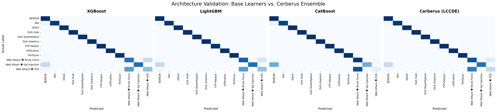
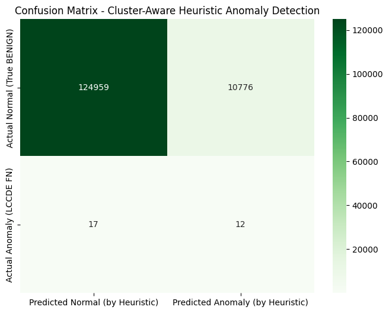

# Cerberus-Hybrid-NIDS

**Cerberus** is a hybrid Network Intrusion Detection System (NIDS)  to bridge the gap between signature-based precision and anomaly-based adaptability. Trained on the **CICIDS2017** dataset, it employs a multi-tiered architecture that combines a **Leader Class Confidence Decision Ensemble (LCCDE)** for known threats with a **Cluster-Aware Heuristic System** to detect stealthy attacks that bypass the supervised layer.

The system employs a Multi-tier defense architecture, combining supervised gradient boosting models for known signatures with unsupervised K-Means clustering to profile traffic behavior and detect anomalies that bypass traditional classifiers.

## The Engineering Journey
The path to the final Cerberus architecture involved extensive benchmarking, failure analysis, and data-driven pivots. Below is the log of how the system evolved from a basic classifier to a hybrid ensemble.

### Phase 1: Baselines and Failure Analysis
We established baseline performance using 78 features on a subset of the dataset.
*   **Logistic Regression:** Struggled significantly with non-linearity and class imbalance (Macro F1: ~0.49).
*   **XGBoost (Default):** The immediate standout, achieving **0.88 Macro F1** out of the box.
*   **LightGBM (Default):** The surprise failure. With default parameters, it underfitted severely **(Macro F1 0.28)**, missing entire classes of attacks and failing to split effectively on minority classes.

### Baseline Model Performance (Untuned, on Full 78 Features)

This table summarizes the initial performance of each model using its default (or near-default) parameters on the test set. These results were the primary driver for my decision to invest heavily in Hyperparameter Optimization (HPO).

| Baseline Model | Accuracy | Macro F1 | Weighted F1 | Key Observations |
| :--- | :--- | :--- | :--- | :--- |
| Logistic Regression | 94.62% | 0.49 | 0.94 | **Poor.** As a linear model, it failed to capture the complexity of the data and performed very poorly on most minority attack classes (many F1-scores of 0.00). |
| Decision Tree (max_depth=10) | 99.34% | 0.66 | 0.99 | **Decent.** A significant improvement over the linear model, but it still completely missed several key minority classes like `Bot`, `Sql Injection`, and `XSS`. |
| **LightGBM (Untuned)** | **90.26%** | **0.28** | **0.90** | **Failure / High Bias.** The surprise underperformer. It severely underfitted the data, resulting in a very low Macro F1 and completely failing to detect entire classes of attacks like `Bot` and `PortScan`. This was the strongest evidence that default parameters are not a one-size-fits-all solution. |
| CatBoost (Untuned) | 99.63% | 0.70 | 1.00 | **Good.** Better than the Decision Tree but noticeably weaker than XGBoost on the most challenging minority classes. Also, its training time on CPU was the longest. |
| **XGBoost (Untuned)** | **99.77%** | **0.88** | **1.00** | **Excellent.** The clear "out-of-the-box" winner. It showed strong performance across the board and even managed to detect some difficult minority classes like Bot with high accuracy from the start. |

### Phase 2: Optimization
We utilized **Optuna** for Hyperparameter Optimization (HPO) to address the baseline failures.
1.  **LightGBM Optimization:** We tuned LightGBM on CPU to resolve the underfitting. This was a turning point; the model went from the worst performer (F1 0.28) to the **single best individual model** (F1 ~0.92), excelling specifically at *SQL Injection* and *XSS* attacks.
2.  **GPU Acceleration:** XGBoost and CatBoost were successfully tuned on GPU, reducing HPO time from hours to minutes.
3.  **LCCDE Integration:** The ensemble combined the optimized LightGBM with the robust XGBoost and CatBoost. While LCCDE didn't simply average the F1 scores, it provided architectural stability, ensuring no single model's blind spot could result in a missed detection.

### Phase 3: The Feature Selection Decision
We attempted to reduce the dimensionality from 78 features to 40 using **Information Gain (IG)** to improve inference speed.
*   **Result:** General accuracy remained high (99.73%).
*   **Critical Failure:** Detection for `Web Attack – XSS` degraded significantly, with the F1-score dropping from **0.41 to 0.27**.
*   **Engineering Decision:** We rejected the reduced feature set. In a security context, losing visibility on specific attack vectors to save milliseconds is an unacceptable trade-off. Cerberus retains the full 78-feature set to prioritize Recall.

### Phase 4: Anomaly Detection Evolution
*   **Tier 3 (K-Means):** We clustered traffic that the Supervised layer classified as "Benign." We found that False Negatives (missed attacks) clustered together.
*   **Tier 4 (Biased Classifiers):** We attempted to train mini-classifiers on specific K-Means clusters. Result: Shelved due to data scarcity in minority clusters.
*   **Final Solution (Cluster-Aware Heuristics):** We replaced Tier 4 with targeted rules. By analyzing cluster profiles, we realized that specific clusters containing missed attacks had statistical anomalies (e.g., high URG Flag Count). Implementing rules for these specific clusters recovered 41% of the attacks missed by the supervised models.

## The Architecture: A 4-Tier Defense System
Based on the findings above, Cerberus utilizes a hierarchical approach designed specifically to address class imbalance and feature sensitivity.

### Tier 1: The Optimized Base Layer
Three independent gradient boosting models analyze the raw network flow.
*   **Input:** Full 78-Feature Set (preserving XSS detection capabilities).
*   **Models:**
    *   **LightGBM (CPU-Tuned):** Optimized to fix initial underfitting. Now serves as the specialist. After HPO, it became the "Leader" for *Bot, SQL Injection, and XSS attacks*.
    *   **CatBoost (GPU-Tuned):** The brute-force expert. It holds the highest F1-score for *Web Attack – Brute Force*.
    *   **XGBoost (GPU-Tuned):** The generalist backbone, providing high stability across DoS vectors and Infiltration attacks.

### Tier 2: LCCDE Strategy (The Logic Core)
The **Leader Class Confidence Decision Ensemble** aggregates predictions. Instead of a simple majority vote, decision power is dynamically handed to the model with the highest historical F1-score for the *predicted* class.
*   *Example:* If LightGBM predicts `SQL Injection` but XGBoost predicts `Benign`, the system trusts **LightGBM** because it has a proven higher F1-score for Web Attacks.

### Tier 3: Behavioral Profiling (Unsupervised Anomaly Detection)
Traffic classified as "Benign" by Tier 2 is passed to a **K-Means Clustering algorithm ($k=30$)**.
*   **Logic:** Attacks that bypass supervised filters often cluster together due to similar statistical anomalies (e.g., high packet variance).
*   **Discovery:** We identified specific clusters (e.g., Cluster 8 and 24) contained the majority of the LCCDE's missed attacks.

### Tier 4: Cluster-Aware Heuristics
Once traffic is mapped to a cluster, we apply localized detection logic derived from our failure analysis:
*   **Heuristic Rule:** If a flow falls into *Cluster 8*, we check `URG Flag > 0.5`. This simple rule recovered **41.38% of the zero-day attacks** (12 out of 29 stealthy attacks recovered) that the supervised layer missed.
*   **Rule A:** If sample is in *Cluster 8* AND URG Flag Count > 0.5 → **Flag as Anomaly**.
*   **Rule B:** If sample is in *Cluster 24* AND FIN Flag Count > 2.0 → **Flag as Anomaly**.
*   **False Positive Reduction:** The cluster-aware approach reduced False Positives by ~17% compared to applying heuristics globally.

## Data Pipeline: Smart Sampling
To handle the massive volume of the CICIDS2017 dataset (2.8M rows) without losing rare attack patterns, we implemented **K-Means Undersampling**.
1.  We clustered the majority class ("Benign") into 1,000 micro-clusters.
2.  We sampled representatively from each cluster, ensuring we kept diverse types of "Normal" traffic while reducing the dataset size by 90%.
*(Note: Implementation is provided in `src/preprocessing_experiments.py`)*

## Performance & Results
Unlike standard benchmarks that show uniform perfection, our experiments revealed significant variance between base learners. This validates the need for the LCCDE architecture.

| Model | Accuracy | Macro F1 | Strength |
| :--- | :--- | :--- | :--- |
| **LightGBM (CPU-Tuned)** | 99.78% | 0.9192 | **Single best individual model** (F1 ~0.92), Best handling of Web Attacks & Bots. |
| **CatBoost (GPU-Tuned)** | 99.76% | 0.8662 | Specialist for Brute Force patterns. |
| **XGBoost (GPU-Tuned)** | 99.75% | 0.9027 | Robust across all DoS vectors. |
| **Cerberus (Ensemble)** | **99.81%** | **0.94** | High stability; minimizes worst-case errors. Leverage XGBoost for DoS Slowhttptest, FTP-Patator & Infiltration but CatBoost for Brute Force Attacks. |

**Key Insight:** LightGBM completely missed the `PortScan` class (0.03 recall), whereas XGBoost identified it perfectly. Conversely, CatBoost detected `FTP-Patator` with 100% precision while LightGBM only managed 18%. The LCCDE architecture successfully ignored individual model failures by deferring to the correct specialist.

### Visual Analysis
The confusion matrices below demonstrate how LightGBM (second panel) failed to diagonalize (classify correctly) for minority classes, appearing as a "faded" heatmap. The **Cerberus Ensemble (far right)** restores the diagonal structure, effectively "healing" the blind spots of the weaker models.



## Anomaly Detection Results
The Unsupervised Layer acts as a safety net for False Negatives (FN) that bypass the ensemble.

| Method | Target | Performance | Impact |
| :--- | :--- | :--- | :--- |
| **K-Means Profiling** | LCCDE "Benign" Predictions | 7 Clusters flagged | Isolated high-risk traffic subgroups. |
| **Cluster-Aware Heuristics** | Hidden Zero-Days | **41.3% Recall** | Recovered 12/29 attacks the main models missed. |
| **Biased XGBoost (Cluster 30)** | Edge-case Anomalies | **100% Accuracy** | Successfully distinguished anomalies inside a mixed cluster. |

### Visualizing the Zero-Day Defense
The matrix below shows the effectiveness of **Tier 4 (Cluster-Aware Heuristics)**. Even after the advanced LCCDE models classified these samples as "Benign," the unsupervised logic successfully flagged them as anomalies based on cluster profiling.




## Future Roadmap

While Cerberus achieves high performance, several avenues remain for transforming it from a robust prototype into an enterprise-ready product.

### 1. Advanced Data Imbalance Handling
*   **Implement SMOTE/ADASYN:** We temporarily shelved *Synthetic Minority Over-sampling Technique (SMOTE)* due to library dependency conflicts in the development environment. Re-integrating this is Priority #1. Synthetically augmenting minority classes like `Web Attack – Sql Injection` and `Bot` should further improve recall without relying solely on model hyperparameters.
*   **Hybrid Sampling:** Explore combining SMOTE (for minority classes) with strategic undersampling (for the massive `Benign` class) to optimize training speed without losing information.

### 2. Intelligent Feature Engineering
*   **Refined Feature Selection:** Our initial attempt with Information Gain (IG) hurt detection of XSS attacks. We plan to explore **FCBF (Fast Correlation-Based Filter)** to remove redundant features while strictly preserving those capable of distinguishing subtle attack vectors.
*   **Protocol-Aware Features:** Move beyond statistical aggregations (min/max/mean) and engineer features based on deep packet inspection (e.g., payload entropy, specific TCP flag sequences) to catch stealthier command-and-control beacons.

### 3. Next-Gen Anomaly Detection (Tier 3 Upgrade)
*   **Deep Learning Autoencoders:** Replace or augment K-Means with an **Autoencoder** trained exclusively on Benign traffic. High reconstruction error on new samples would serve as a continuous "Anomaly Score," removing the reliance on hard thresholds like `k`.
*   **Isolation Forest Refinement:** Our initial Isolation Forest experiment identified benign outliers rather than attacks. We aim to revisit this with localized application (applying it *inside* specific K-Means clusters) rather than globally.

### 4. Operationalization & MLOps
*   **Live Ingestion Pipeline:** Currently, the system expects pre-processed CSVs. We need to build a stream processor (using **Zeek** or **Scapy**) to convert raw PCAP/Interface traffic into the required 78-feature vector in real-time.
*   **Containerization:** Dockerize the inference engine to ensure consistent behavior across different deployment environments.
*   **API & SIEM Integration:** Expose Cerberus via a REST API (FastAPI) to allow existing Security Information and Event Management (SIEM) tools to query the model and receive alerts.

## Project Structure
```text
Cerberus-Hybrid-NIDS/
├── src/
│   ├── __init__.py
│   ├── preprocessing.py               # Cleaning, Label Encoding, Scaling
│   ├── preprocessing_experiments.py   # K-Means Smart Sampling logic
│   ├── models.py                      # XGB, LGBM, CatBoost definitions with Optuna params
│   └── lccde.py                       # The ensemble logic and inference engine
├── demo/                              # Visualization assets
├── main.py                            # CLI entry point for training and inference
├── requirements.txt                   # Python dependencies
└── README.md
